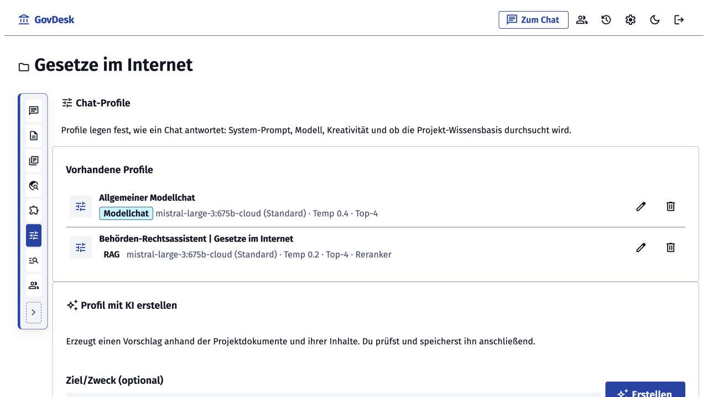
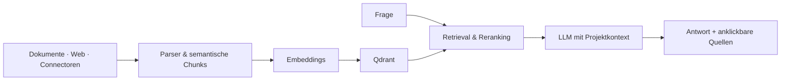

<!--
SPDX-FileCopyrightText: 2026 GovDesk-Mitwirkende

SPDX-License-Identifier: EUPL-1.2
-->

# GovDesk

<p align="center">
  <strong>Souveräne KI für die öffentliche Verwaltung.</strong><br>
  Eigene Dokumente, Gesetze und Webquellen erschließen – mit lokalen Modellen,
  nachvollziehbaren Fundstellen und voller Kontrolle über die Infrastruktur.
</p>

<p align="center">
  <a href="LICENSE"></a>
  
  
  
</p>



GovDesk ist eine Open-Source-Plattform für Behörden und öffentliche Einrichtungen,
die generative KI nicht als Blackbox betreiben wollen. Dokumente und externe Quellen
werden projektbezogen verarbeitet, lokal eingebettet und in Chats mit anklickbaren
Belegen nutzbar gemacht. Modelle können vollständig über Ollama laufen; alternativ
lassen sich kontrolliert OpenAI-kompatible Endpunkte anbinden.

> **Projektstatus:** GovDesk wird aktiv entwickelt. Die Kernstrecke von Ingestion,
> Retrieval und Quellenprüfung bis zu Rollen, Administration und Betrieb ist
> funktionsfähig; vor einem Produktionseinsatz sind eigene Sicherheits-, Datenschutz-
> und Lasttests erforderlich.

## Warum GovDesk?

| | |
|---|---|
| 🏛️ **Für Verwaltung gedacht** | Projekte, Rollen, OIDC, Audit-Log, API-Keys und eine Oberfläche nach dem [KERN UX-Standard](https://www.kern-ux.de/) statt eines Demo-Chatfensters. |
| 🔎 **Nachvollziehbar statt magisch** | Antworten verlinken direkt auf Fundstellen. Projekt-Admins sehen Rang, Score und den tatsächlich verwendeten Retrieval-Chunk. |
| 🔐 **Souverän betreibbar** | Self-hosted, ohne Telemetrie und ohne CDN. Lokale Modelle und Offline-Betrieb nach einmaliger Bereitstellung der Modellartefakte. |
| 🔌 **Wissen bleibt aktuell** | Upload, REST-API, Internet-Agent, periodischer Sync und Connectoren münden in dieselbe kontrollierte Wissensbasis. |

## Drei klar getrennte Chatmodi

| Modus | Verhalten | Kennzeichnung |
|---|---|---|
| **RAG** | Antwortet aus ausgewählten Projektquellen und zitiert die verwendeten Chunks. | Anklickbare Quellen und optional Admin-Retrieval-Details |
| **RAG mit Fallback** | Nutzt Modellwissen nur, wenn keine passende Projektquelle gefunden wurde. | Deutlicher Hinweis im Antworttext und in der Quellenleiste |
| **Modellchat** | Überspringt Retrieval vollständig und arbeitet wie ein normaler LLM-Chat. | Profilbadge und Hinweis „Wissensbasis ausgeschaltet“ |

Der Fallback wird pro Projekt konfiguriert, der Modellchat zusätzlich plattformweit
freigegeben. Damit entscheidet nicht das Modell, wann es ohne Projektwissen antworten
darf, sondern die Organisation.

## Von der Quelle bis zur belegten Antwort

1. **Wissen aufnehmen** – PDF, DOCX, ODT, TXT, Markdown, HTML, Webquellen,
   REST-API oder Connector.
2. **Verarbeiten** – Parsing, optionales OCR, semantische Chunks und Embeddings
   laufen nachvollziehbar über die Warteschlange.
3. **Suchen** – Qdrant liefert Kandidaten; optional bewertet ein Reranker die
   relevantesten Textstellen neu.
4. **Antworten** – Das Sprachmodell erhält nur den freigegebenen Projektkontext.
5. **Prüfen** – Nutzende öffnen Fundstellen direkt; Admins sehen Retrieval-Ränge,
   Scores und Prompt-Chunks.



## Produkt-Einblick


System-Prompt, Modell, Temperatur, Sammlungen, Reranker und RAG-Modus lassen
sich als wiederverwendbare Profile konfigurieren. Der Gesetze-Connector kann
Bundesgesetze aus dem täglich aktualisierten
[QuantLaw-Archiv](https://github.com/QuantLaw/gesetze-im-internet) auswählen,
Chunks vorab prüfen und inkrementell synchronisieren.

## Funktionsumfang

- **Projekt- und Rechteverwaltung:** Eigentümer, Administratoren, Bearbeiter und Betrachter
- **Dokument-Ingestion:** PDF, DOCX, ODT, TXT, Markdown und HTML; Upload oder REST-API
- **OCR für Scans und Bilder:** optional über ein lokales Vision-Modell
- **RAG-Pipeline:** Qdrant, bge-m3-Embeddings und optional bge-reranker-v2-m3
- **Quellenprüfung:** anklickbare Passagen sowie Admin-Diagnose mit Rang, Score und Inhalt
- **Internet-Agent:** klassisches oder KI-geführtes Crawling mit periodischem Re-Crawl
- **Connectoren:** aktuell Nextcloud und Bundesgesetze aus dem QuantLaw-Archiv
- **Chat-Profile:** Modell, Prompt, Temperatur, Top-K, Reranking und Sammlungen pro Projekt
- **Provider:** Ollama lokal/Cloud und OpenAI-kompatible Endpunkte
- **Identität und Betrieb:** lokale Nutzerverwaltung, Keycloak/OIDC, Audit-Log,
  API-Keys, Import/Export, Einrichtungs-Wizard und Hell-/Dunkelmodus

## Schnellstart

```bash
cp .env.example .env    # Werte anpassen (mindestens GOVDESK_SECRET_KEY)
docker compose up -d --wait
# Erststart: http://localhost:8000 → Einrichtungs-Wizard
```

Für die lokale Entwicklung mit Autoreload:

```bash
make setup    # einmalig: Abhängigkeiten, .env, Dienste, Migrationen
make dev      # App (mit Autoreload) + Worker — http://localhost:8000
```

Der Wizard prüft Dienste und Modelle und legt das erste Admin-Konto an.

## Entwicklung

Voraussetzungen: [uv](https://docs.astral.sh/uv/), Docker und — auf macOS —
ein natives [Ollama](https://ollama.com) für die Apple-GPU. Unter Linux kann
Ollama als Compose-Dienst laufen.

Alle weiteren Kommandos zeigt `make hilfe` (u. a. `make seed` für Demo-Daten,
`make test`, `make smoke`, `make stop`). Ohne make:

```bash
uv sync
docker compose -f docker-compose.yml -f docker-compose.dev.yml up -d postgres qdrant reranker
uv run govdesk migrate
uv run govdesk serve --reload       # App auf http://localhost:8000
uv run govdesk worker               # Job-Worker (zweites Terminal)
```

## Betrieb (Produktion)

### Reverse-Proxy & TLS

GovDesk gehört hinter einen TLS-terminierenden Reverse-Proxy. Für SSE-Streaming
(Chat) muss Response-Buffering aus sein — nginx-Beispiel:

```nginx
location / {
    proxy_pass http://127.0.0.1:8000;
    proxy_set_header Host $host;
    proxy_set_header X-Forwarded-Proto $scheme;
    proxy_buffering off;          # wichtig für SSE
    proxy_read_timeout 300s;
}
```

`GOVDESK_COOKIE_SECURE=true` setzen (Standard) und `GOVDESK_SECRET_KEY`
mit `python3 -c "import secrets; print(secrets.token_urlsafe(48))"` erzeugen.

### Modelle vorab laden / Offline-Betrieb

Beim ersten Start werden Modelle heruntergeladen (bge-m3 ≈ 1,2 GB,
gemma3:4b ≈ 3,3 GB, Reranker ≈ 2,3 GB). Für Air-Gap-Umgebungen:

```bash
docker compose exec ollama ollama pull bge-m3
docker compose exec ollama ollama pull gemma3:4b
# Reranker-Cache liegt im Volume "reranker_cache"; vorbefüllen und
# HF_HUB_OFFLINE=1 setzen, dann findet kein Download mehr statt.
```

Alle Modell-Caches liegen in benannten Docker-Volumes und überleben Updates.

### GPU

Ollama profitiert stark von einer GPU. NVIDIA-Beispiel im Compose-Override:

```yaml
services:
  ollama:
    deploy:
      resources:
        reservations:
          devices:
            - driver: nvidia
              count: all
              capabilities: [gpu]
```

### Keycloak / SSO

```bash
GOVDESK_OIDC_ENABLED=true
GOVDESK_OIDC_ISSUER=https://keycloak.example.de/realms/behoerde
GOVDESK_OIDC_CLIENT_ID=govdesk
GOVDESK_OIDC_CLIENT_SECRET=…
#GOVDESK_LOCAL_LOGIN_ENABLED=false   # nur SSO zulassen
```

Redirect-URI im Keycloak-Client: `https://govdesk.example.de/auth/oidc/callback`.
Zum Ausprobieren: `docker compose --profile keycloak up -d` startet ein
Keycloak mit Demo-Realm (siehe `deploy/keycloak/`).

### Headless-Administration

```bash
docker compose exec app govdesk createadmin --username admin   # ohne Wizard
./scripts/smoke_test.sh                                        # End-to-End-Check
```

## Technik

Python 3.14 · FastAPI · HTMX · PostgreSQL · Qdrant · Ollama · procrastinate ·
Text-Embeddings-Inference (Reranker) · Docker Compose

## Mitmachen

GovDesk ist bewusst als Open-Source-Baustein für souveräne Verwaltungs-KI angelegt.
Fehlerberichte, Ideen für weitere Fach-Connectoren, Dokumentation und Pull Requests
sind willkommen. Vor größeren Änderungen empfiehlt sich ein Issue, damit Architektur
und Sicherheitsanforderungen früh abgestimmt werden können.

Geplante Themen und offene Ausbaupfade stehen in der [ROADMAP.md](ROADMAP.md).

## Lizenz

[EUPL-1.2](LICENSE) — Lizenz der Europäischen Union, geeignet für Software der öffentlichen Hand.
